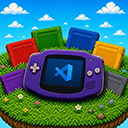

# GBA Emulator for VS Code

  

Play Game Boy Advance games without leaving your editor. GBA Emulator brings a lightweight, in-editor handheld experience to VS Code with quick ROM loading, save support, and a compact Activity Bar entry designed for everyday use.

Built on the [gbajs](https://github.com/endrift/gbajs) core by Jeffrey Pfau (endrift).

## Features

- Embedded GBA emulator in the VS Code Activity Bar
- Fast ROM loading from your local filesystem
- Pause, resume, reset, and stop controls
- Screenshots directly from the running game
- Save states with import and export support
- Standard `.sav` import and export for compatibility with other tools
- Automatic internal saving between VS Code sessions
- Optional workspace `.sav` output for easier file-based backup
- Adjustable emulator volume
- Keyboard-first gameplay
- Multilingual interface support

## How to Use

1. Install the extension from the VS Code marketplace
2. Click the GBA icon in the Activity Bar
3. Load a ROM file and start playing
4. Use the toolbar controls or Command Palette to manage your game
5. Click the game canvas and use your keyboard to play

## Keyboard Controls

| Key        | GBA Action |
| ---------- | ---------- |
| Arrow keys | D-Pad      |
| Z          | A          |
| X          | B          |
| A          | L          |
| S          | R          |
| Enter      | Start      |
| Backslash  | Select     |

## Available Commands

All commands are available from the Command Palette (`Ctrl+Shift+P`):

| Command                   | Description                               |
| ------------------------- | ----------------------------------------- |
| `GBA: Load ROM`           | Open a file picker to select a ROM        |
| `GBA: Pause`              | Pause the running emulator                |
| `GBA: Resume`             | Resume gameplay                           |
| `GBA: Reset`              | Restart the current session               |
| `GBA: Stop`               | Stop the emulator                         |
| `GBA: Screenshot`         | Capture the current frame                 |
| `GBA: Save State`         | Save a full emulator snapshot             |
| `GBA: Load State`         | Restore the most recent internal snapshot |
| `GBA: Export State`       | Export a snapshot as `.gbastate`          |
| `GBA: Import State`       | Import a `.gbastate` snapshot             |
| `GBA: Export Save (.sav)` | Export the current battery save           |
| `GBA: Import Save (.sav)` | Import a battery save                     |

## Settings

| Setting                  | Type    | Default | Description                                                   |
| ------------------------ | ------- | ------- | ------------------------------------------------------------- |
| `gbaEmulator.volume`     | number  | 50      | Default emulator volume (0-100)                               |
| `gbaEmulator.saveToFile` | boolean | false   | Automatically save progress as a `.sav` file in the workspace |
| `gbaEmulator.debug`      | boolean | false   | Enable detailed console logs for troubleshooting              |

## Contributing

Want to contribute? Check out the [CONTRIBUTING.md](CONTRIBUTING.md) file for development guidelines, architecture details, and build instructions.

## License

BSD-2-Clause

- Original emulator core: Copyright © 2012-2013 Jeffrey Pfau
- VS Code extension: Copyright © 2024-2026 Strifelab
